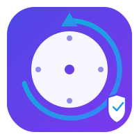

<p align="center">
  
</p>

# Go Backup System

Time Machine tarzinda yedekleme sistemi. Go ile yazilmis sunucu ve Wails (Go + React) ile yazilmis masaustu istemci icermektedir.

## Bilesenler

- **go-backup-server**: Go/Gin ile yazilmis yedekleme sunucusu
- **backup-client**: Wails ile yazilmis masaustu istemci (Linux, macOS, Windows)
- **admin-panel**: React ile yazilmis web tabanli yonetim paneli

## Ozellikler

- Time Machine tarzinda dosya versiyonlama
- AES sifreleme ile guvenli yedekleme
- Incremental yedekleme (sadece degisen dosyalar)
- Dosya ve dizin bazinda geri yukleme
- Birden fazla cihaz destegi
- Kullanici kotasi yonetimi
- SQLite tabanli katalog sistemi

## Hizli Baslangic

### Sunucu Kurulumu

```bash
cd go-backup-server
go build -o backup-server ./cmd/server
./backup-server
```

Detayli kurulum icin: [go-backup-server/README.md](go-backup-server/README.md)

### Istemci Kurulumu

```bash
cd backup-client
wails build
```

Detayli kurulum icin: [backup-client/README.md](backup-client/README.md)

## Lisans

GPL v3 - Detaylar icin [LICENSE](LICENSE) dosyasina bakiniz.
